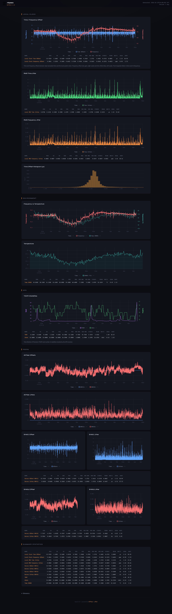

# ntpviz 2.0

Interactive NTP visualization dashboard with real-time charts, replacing the legacy ntpviz static HTML+PNG pages.



## Overview

ntpviz 2.0 replaces the old `ntpviz` static page generators (gnuplot PNGs + static HTML) with a modern single-page dashboard featuring interactive [uPlot](https://github.com/leeoniya/uPlot) charts. It runs on a Raspberry Pi with NTPsec and a GPS reference clock, deploying as a static site on GitHub Pages.

## Features

- **Interactive charts** - zoom, pan, and hover tooltips on all time-series data
- **Dark theme** - purpose-built dark UI optimized for monitoring dashboards
- **1-day and 7-day views** - toggle between time ranges with a single click
- **Auto-refresh** - page reloads every 30 minutes to show latest data
- **No build tools** - single HTML file with inline CSS/JS, no npm or bundlers
- **Sections:**
  - **Local Clock** - offset, jitter, stability, and offset histogram
  - **Environment** - frequency error and temperature sensors
  - **GPS** - TDOP and satellite count
  - **Peers** - per-peer offset and jitter overlays
  - **Summary Statistics** - tabular overview of all peers

## Architecture

```
NTPsec logs ──► ntpviz2-build.py ──► JSON data files ──► index.html (uPlot)
                     │                                         │
              /var/log/ntpsec/                          GitHub Pages
```

- **`ntpviz2-build.py`** - Python script that reads NTPsec log files, downsamples with numpy/scipy, and outputs columnar JSON
- **`index.html`** - Single-file dashboard with inline CSS and JavaScript
- **`update-ntpviz2.sh`** - Cron script that rebuilds data and pushes to GitHub Pages

## Requirements

- Python 3 with `numpy` and `scipy`
- `ntp.statfiles` (system package, installed with NTPsec)
- A running NTPsec instance writing stats to `/var/log/ntpsec/`

## Usage

Build the JSON data files:

```bash
python3 ntpviz2-build.py -d /var/log/ntpsec -o . -p 1,7 -c
```

Preview locally:

```bash
python3 -m http.server 8080
```

## Deployment

The update script is designed to run via cron every 30 minutes:

```bash
# crontab entry
*/30 * * * * /path/to/update-ntpviz2.sh
```

It rebuilds the JSON data and force-pushes to the GitHub Pages branch.

## Data Format

JSON files use columnar arrays matching uPlot's native format:

```json
{"data": {"time": [...], "offset": [...], "frequency": [...]}}
```

Downsampling uses 30-second buckets for 1-day and 120-second buckets for 7-day views.

## License

This project is based on the original [ntpviz](https://docs.ntpsec.org/latest/ntpviz.html) from the NTPsec project.
